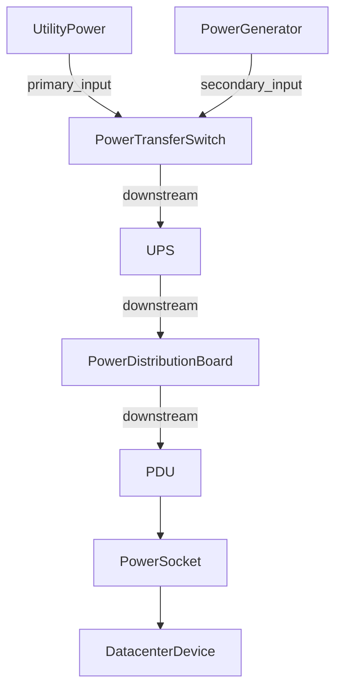
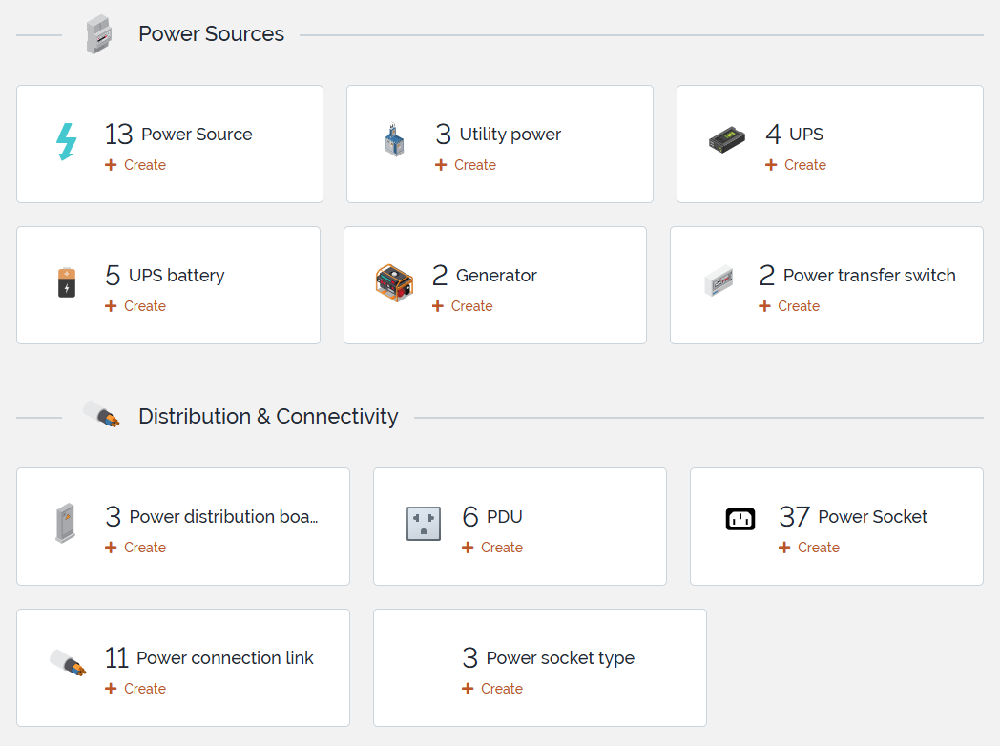
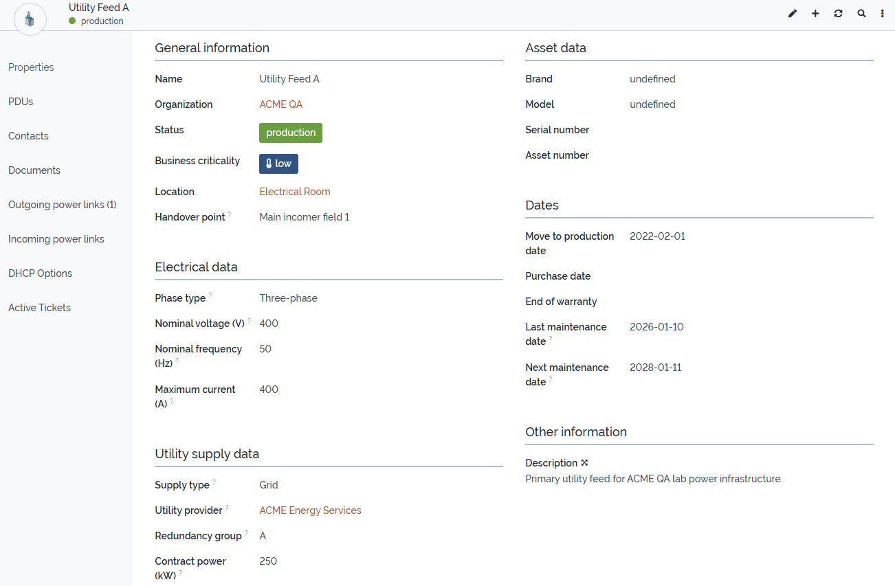
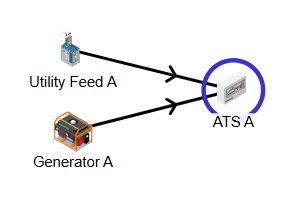
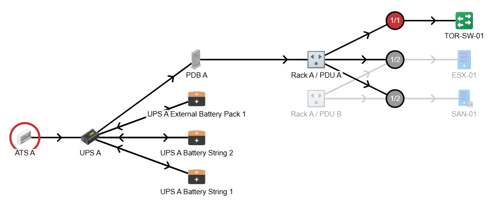
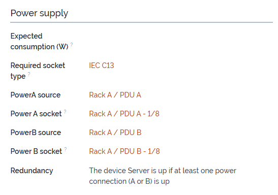
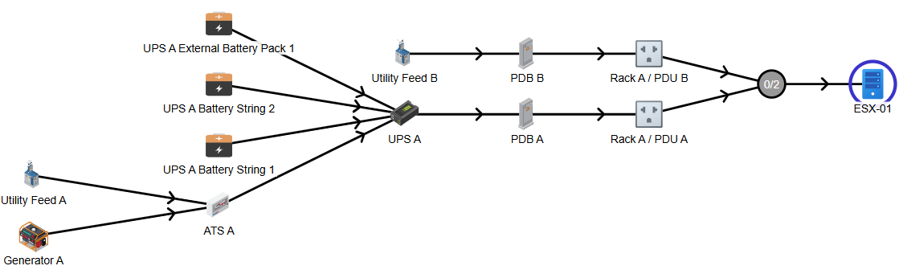

# iTop-br-power-infrastructure

Copyright (c) 2026 Björn Rudner

## What?

`iTop-br-power-infrastructure` is an extension for iTop that enhances the native CMDB data model for documenting and managing electrical power infrastructure components.

It extends the native iTop power model and introduces additional classes, attributes, synchronization logic, and generic topology links for documenting power supply paths in environments such as data centers, server rooms, technical facilities, and related infrastructure areas.

## Features

* Extends the native iTop power infrastructure model
* Adds generic electrical and maintenance-related attributes to existing power classes
* Introduces dedicated classes for:

  * `UtilityPower`
  * `UPS`
  * `UPSBattery`
  * `PowerGenerator`
  * `PowerTransferSwitch`
  * `PowerDistributionBoard`
  * `PowerSocketType`
  * `PowerSocket`
* Introduces `lnkPowerConnectionToPowerConnection` for generic directional topology modeling between `PowerConnection` objects
* Extends `PDU` with dedicated power socket handling
* Supports Power A / Power B assignment for `DatacenterDevice` objects
* Includes synchronization logic between `PowerSocket`, `PDU`, and `DatacenterDevice`
* Supports both legacy native power relations and the preferred generic topology model

## Main Classes

The extension builds on the following native iTop classes:

* `PowerConnection`
* `PowerSource`
* `PDU`
* `DatacenterDevice`

The extension introduces the following additional classes:

* `UtilityPower`
* `UPS`
* `UPSBattery`
* `PowerGenerator`
* `PowerTransferSwitch`
* `PowerDistributionBoard`
* `PowerSocketType`
* `PowerSocket`
* `lnkPowerConnectionToPowerConnection`

## Preferred Topology Model

The preferred way to model power flow in this extension is the generic link model:

* `lnkPowerConnectionToPowerConnection`

This allows directional relationships between `PowerConnection` objects, for example:

* utility feed → transfer switch
* generator → transfer switch
* transfer switch → UPS
* UPS → distribution board
* distribution board → PDU

Recommended role usage:

* use `downstream` as the standard generic source-to-target role
* use `primary_input` and `secondary_input` for transfer switch input modeling

The native iTop `PowerSource` → `PDU` relation remains supported for compatibility.

## Example Topology

## Installation

1. Clone or copy this extension into your iTop `extensions` directory:

   `extensions/iTop-br-power-infrastructure`

2. Make sure the extension files are placed in the correct module directory structure.

3. Run the iTop setup or upgrade process.

4. Apply the data model changes and complete the update.

### Optional bridge modules

This repository also includes optional bridge modules that optimize the PDU presentation layout when specific third-party extensions are installed.

* `br-power-infrastructure-bridge-for-datacenter-view`
* `br-power-infrastructure-bridge-for-datacenter-view-extended`
* `br-power-infrastructure-bridge-for-teemip-ip-mgmt`

These bridge modules do not introduce new business classes; they only adapt field placement in the `PDU` detail view to keep UI sections aligned with the corresponding companion extensions.

## Upgrade Notes for Version 2.0.0

Version `2.0.0` further establishes the generic link model `lnkPowerConnectionToPowerConnection` as the preferred way to document directional relationships between `PowerConnection` objects.

During upgrade:

* existing legacy `PDU.powerstart_id` relations are imported into the generic link model with role `downstream`
* existing generic links using the role `output` are migrated to `downstream`
* duplicate `downstream` links are not created

The legacy `powerstart_id` field is not removed during upgrade.

## Documentation

A more detailed guide covering modeling principles, class usage, topology design, screenshots, demo data, and migration behavior is available here:

* [User Guide](doc/User-Guide.md)

## Screenshots

### Power Infrastructure Overview

### Utility Power

### Transfer Switch Relations

### Redundant Device Power Assignment

## iTop Compatibility

The extension was tested on:

* iTop `3.2.2`

Core module dependencies:

* `itop-config-mgmt/3.2.0`
* `itop-datacenter-mgmt/3.2.0`
* `itop-virtualization-mgmt/3.2.0`
* `itop-storage-mgmt/3.2.0`

Optional bridge dependencies are only required when using the related companion extensions.

## Attribution

This extension uses icons from:

 by Arthur Shlain from [https://thenounproject.com/browse/icons/term/power-connector/](https://thenounproject.com/browse/icons/term/power-connector/)
