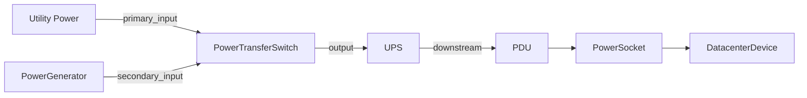
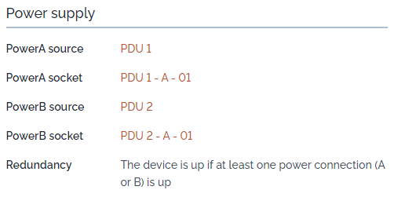
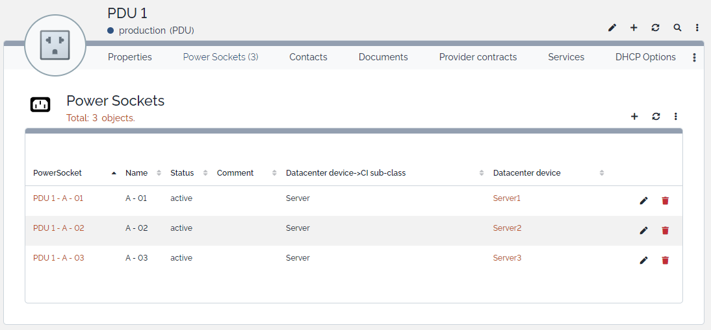

# iTop-br-power-infrastructure

Copyright (c) 2026 Björn Rudner

## What?

`iTop-br-power-infrastructure` is an extension for iTop that enhances the native CMDB data model for documenting and managing power infrastructure components.

The extension focuses on structured modeling of electrical power supply components and their relationships in environments such as data centers, server rooms, technical facilities, and other infrastructure areas where reliable documentation of power dependencies is required.

It extends the native iTop power model and introduces additional classes, attributes, and synchronization logic for documenting technical, operational, and maintenance-related information.

## Features

- Extends the native iTop classes related to power infrastructure
- Adds generic electrical and maintenance-related attributes to existing power classes
- Introduces a dedicated `UPS` class derived from `PowerSource`
- Introduces a dedicated `UPSBattery` class derived from `PhysicalDevice`
- Introduces a dedicated `PowerGenerator` class derived from `PowerSource`
- Introduces a dedicated `PowerTransferSwitch` class derived from `PowerConnection`
- Introduces a generic link class `lnkPowerConnectionToPowerConnection` for modeling relationships between `PowerConnection` objects
- Supports relationships between UPS systems and their battery units
- Improves documentation of electrical characteristics such as phase type, nominal voltage, nominal frequency, and maximum current
- Adds UPS-specific documentation fields such as topology, rated power, and autonomy time
- Adds battery-specific documentation fields such as battery role, battery type, battery status, replacement dates, voltage, and capacity
- Adds generator-specific documentation fields such as generator type, fuel type, tank capacity, runtime, and test schedule
- Adds transfer-switch-specific documentation fields such as switch type
- Introduces the `PowerSocket` class to model individual PDU outlets
- Extends `PDU` with dedicated power socket handling
- Allows `DatacenterDevice` objects to be connected to specific PDU sockets
- Provides automatic synchronization logic between `PowerSocket`, `PDU`, and `DatacenterDevice`
- Supports automatic slot assignment for Power A / Power B connections
- Includes consistency checks and rollback logic for invalid assignments
- Supports structured modeling of generic power paths such as utility → transfer switch → UPS → PDU

## Data Model

The extension currently builds on the following native iTop classes:

- `PowerConnection`
- `PowerSource`
- `PDU`
- `DatacenterDevice`

The extension currently introduces the following additional classes:

- `UPS`
- `UPSBattery`
- `PowerGenerator`
- `PowerTransferSwitch`
- `PowerSocket`
- `lnkPowerConnectionToPowerConnection`

### Extended native classes

#### `PowerConnection`

Additional generic attributes for electrical and maintenance-related documentation:

- `phase_type`
- `nominal_voltage`
- `nominal_frequency`
- `max_current_ampere`
- `last_maintenance_date`
- `next_maintenance_date`

In addition, `PowerConnection` can be linked to other `PowerConnection` objects through the generic link model.

#### `PowerSource`

Presentation enhancements for inherited generic power-related attributes.

#### `PDU`

Presentation enhancements for inherited generic power-related attributes and support for individual power sockets.

#### `DatacenterDevice`

Extended to support dedicated Power A / Power B socket assignments.

### New classes

#### `UPS`

A dedicated UPS class based on `PowerSource`.

Current UPS-specific attributes include:

- `ups_topology`
- `rated_power_va`
- `rated_power_watt`
- `autonomy_time`

In addition, the class provides:

- `batteries_list`
- inherited relationships to downstream PDUs
- generic power topology links through `lnkPowerConnectionToPowerConnection`

#### `UPSBattery`

A dedicated battery unit class based on `PhysicalDevice`.

Current battery-specific attributes include:

- `ups_id`
- `battery_role`
- `battery_type`
- `battery_status`
- `battery_voltage`
- `battery_capacity_ah`
- `last_replacement_date`
- `next_replacement_date`

#### `PowerGenerator`

A dedicated generator class based on `PowerSource`.

Current generator-specific attributes include:

- `generator_type`
- `fuel_type`
- `rated_power_kva`
- `fuel_tank_capacity_l`
- `fuel_consumption_lph`
- `autonomy_time`
- `start_method`
- `is_ats_available`
- `last_test_date`
- `next_test_date`

In addition, the class provides:

- inherited relationships to downstream PDUs
- generic power topology links through `lnkPowerConnectionToPowerConnection`

#### `PowerTransferSwitch`

A dedicated transfer switch class based on `PowerConnection`.

Current transfer-switch-specific attributes include:

- `switch_type`

The class is intended to represent electrical transfer switches used to switch loads between different power sources, for example between utility power and generator supply.

#### `PowerSocket`

A `PowerSocket` represents an individual physical outlet on a PDU.

Each socket:

- belongs to exactly one `PDU`
- may be connected to exactly one `DatacenterDevice`
- can be assigned to either Power A or Power B on the connected device

#### `lnkPowerConnectionToPowerConnection`

A generic link class used to model directional relationships between `PowerConnection` objects.

This class can be used to document power paths such as:

- utility power → transfer switch
- generator → transfer switch
- transfer switch → UPS
- UPS → PDU

Current link attributes include:

- `source_powerconnection_id`
- `target_powerconnection_id`
- `link_role`
- `comment`

## Relations

The current data model supports relationships such as:

- `PowerSource` feeding `PDU`
- `UPS` acting as a specialized `PowerSource`
- `UPS` owning one or more `UPSBattery` objects
- `PowerGenerator` acting as a specialized `PowerSource`
- `PowerTransferSwitch` acting as a switching component within the power supply chain
- `PDU` owning one or more `PowerSocket` objects
- `PowerSocket` being linked to a `DatacenterDevice`
- generic directional links between `PowerConnection` objects through `lnkPowerConnectionToPowerConnection`
- chained power infrastructure dependencies through the native iTop power model

## Power Topology Model

The extension supports two approaches for modeling electrical relationships:

### Native iTop power chain

The native iTop model already provides relationships such as:

- `PowerSource` feeding `PDU`

This remains available and can still be used where appropriate.

### Generic power links

For more flexible and realistic topologies, the extension introduces `lnkPowerConnectionToPowerConnection`.

This allows directional modeling of electrical paths between `PowerConnection` objects, for example:

- utility power → transfer switch
- generator → transfer switch
- transfer switch → UPS
- UPS → PDU

This approach is especially useful for documenting:

- transfer switches
- generators
- chained power supply paths
- more complex emergency power configurations

## PowerSocket Logic

The integrated PowerSocket functionality provides synchronization logic between:

- `PowerSocket`
- `PDU`
- `DatacenterDevice`

Each `DatacenterDevice` can be connected to:

- one Power A socket
- one Power B socket

The extension ensures that:

- no more than two sockets are assigned to a single `DatacenterDevice`
- slots are automatically assigned (A first, then B)
- connections stay consistent when objects are updated or deleted
- invalid assignments are rejected or rolled back

## How to Use

### UPS and UPSBattery

Use the `UPS` class to document dedicated uninterruptible power supplies and the `UPSBattery` class to document associated battery units.

Typical usage includes:

- documenting UPS-specific electrical and technical data
- assigning one or more battery units to a UPS
- documenting replacement cycles and battery status

### PowerGenerator

Use the `PowerGenerator` class to document diesel generators and other common emergency power units (gensets).

Typical usage includes:

- documenting generator category (standby, prime, continuous, mobile)
- tracking fuel type (for example diesel, gas, HVO, biodiesel, dual-fuel)
- recording rated power, fuel tank capacity, and fuel consumption
- planning generator test runs using last/next test dates

### PowerTransferSwitch

Use the `PowerTransferSwitch` class to document transfer switches within the electrical supply chain.

Typical usage includes:

- documenting manual, automatic, static, or bypass transfer switches
- distinguishing switching devices from power sources
- preparing structured modeling of power paths between utility supply, generator, UPS, and downstream distribution

### Generic PowerConnection Links

Use `lnkPowerConnectionToPowerConnection` to model directional power paths between `PowerConnection` objects.

Typical usage includes:

- linking utility supply to a transfer switch
- linking a generator to a transfer switch
- linking a transfer switch to a UPS
- linking a UPS to a PDU

Recommended modeling direction:

- always model connections from **source*- to **target**

Examples:

- utility power → transfer switch
- generator → transfer switch
- transfer switch → UPS
- UPS → PDU

## Example Topology

The following example shows a typical emergency power path modeled with this extension:

This example represents a setup where:

- the normal utility supply is the primary source
- the generator is the secondary backup source
- the transfer switch selects the active source
- the UPS protects downstream equipment
- the PDU distributes power within the rack
- individual PowerSockets connect the final devices

A possible modeling of the generic power links could look like this:

- `Utility Power` → `PowerTransferSwitch` with role `primary_input`
- `PowerGenerator` → `PowerTransferSwitch` with role `secondary_input`
- `PowerTransferSwitch` → `UPS` with role `output`
- `UPS` → `PDU` with role `downstream`

This approach makes it possible to document both simple and more advanced power topologies in a structured and extensible way.

### PowerSockets

#### Creating PowerSockets

PowerSockets represent physical outlets on a PDU.

1. Open the PDU object in iTop.
2. Scroll to the PowerSockets list.
3. Add one or more PowerSockets.
4. Give each socket a meaningful name, for example `Outlet 1`, `A01`, or `Rack-3-Port-5`.

Each `PowerSocket` belongs to exactly one `PDU`.

#### Connecting a PowerSocket to a DatacenterDevice

You can connect a `PowerSocket` to a `DatacenterDevice` in two ways.

##### Option A: From the PowerSocket side

1. Open a `PowerSocket`.
2. Set the `Datacenter Device` field.
3. Save.

The system will automatically:

- assign the socket to slot Power A or Power B
- set the corresponding PDU reference on the device

##### Option B: From the DatacenterDevice side

1. Open a `DatacenterDevice` such as a server, storage system, or switch.
2. Select a `PowerSocket` in:

   - `Power A socket`, or
   - `Power B socket`
3. Save.

The system will automatically:

- link the `PowerSocket` back to the `DatacenterDevice`
- keep both sides consistent

#### Automatic Slot Assignment

Each `DatacenterDevice` can have:

- one Power A socket
- one Power B socket

When connecting a `PowerSocket`:

1. Slot A is used first
2. Slot B is used if A is already occupied
3. If both slots are occupied, the assignment is rejected

#### Deleting a PowerSocket

When a `PowerSocket` is deleted:

- the slot reference on the `DatacenterDevice` is automatically cleared
- Power A / Power B fields are reset if they pointed to this socket

This prevents broken references and dangling assignments.

## Installation

1. Clone or copy this extension into your iTop `extensions` directory:

   `extensions/iTop-br-power-infrastructure`

2. Make sure the extension files are placed in the correct module directory structure.

3. Run the iTop setup or upgrade process.

4. Apply the data model changes and complete the update.

## Status

This extension is currently in an early beta stage.

The current implementation focuses on:

- extending the generic native power infrastructure model
- introducing a dedicated UPS class
- introducing a dedicated UPS battery class
- introducing a dedicated generator class
- introducing a dedicated transfer switch class
- introducing a generic power link model between `PowerConnection` objects
- introducing PowerSocket support for PDUs
- establishing relations between UPS systems and their battery units
- providing synchronized socket handling for `DatacenterDevice`
- preparing the module structure for future power infrastructure extensions

## iTop Compatibility

The extension was tested on:

- iTop `3.2.2`

Required dependency:

- `itop-datacenter-mgmt/3.2.1`

## Roadmap

Planned or possible future enhancements may include:

- additional UPS-related technical attributes
- support for more advanced generator-related classes
- more detailed transfer switch modeling
- improved monitoring and operational metadata
- further refinement of power infrastructure relations
- additional power distribution and socket-level modeling improvements

## Screenshots

### Power Supply

### PDU

## Attribution

This extension uses icons from:

 by Arthur Shlain from [https://thenounproject.com/browse/icons/term/power-connector/](https://thenounproject.com/browse/icons/term/power-connector/)
