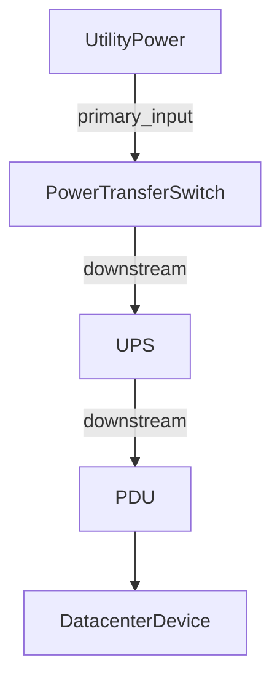
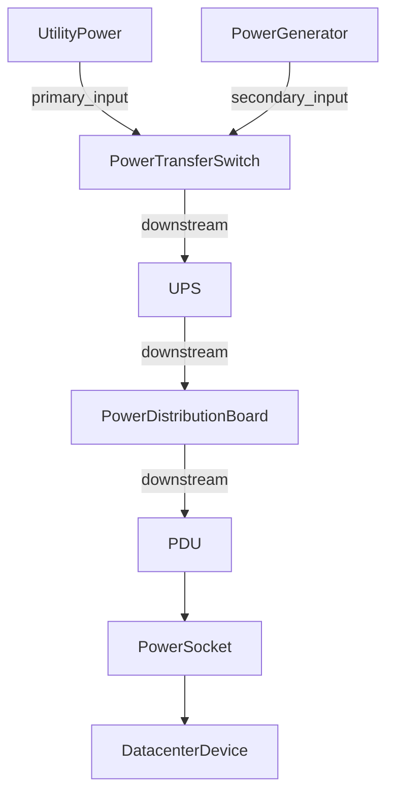

# User Guide

## iTop-br-power-infrastructure

This guide provides a more detailed explanation of the data model, modeling principles, and recommended usage of the `iTop-br-power-infrastructure` extension.

It is intended for administrators, implementers, and advanced users who want to understand not only which classes are available, but also how they should be used together in a consistent and realistic way.

---

## 1. Introduction

`iTop-br-power-infrastructure` extends the native iTop CMDB model for documenting electrical power infrastructure.

The module is designed for environments such as:

* data centers
* server rooms
* technical facilities
* critical utility rooms
* electrical supply areas around IT systems

The extension makes it possible to document not only basic power dependencies, but also more structured and realistic topologies involving utility feeds, generators, transfer switches, UPS systems, distribution boards, PDUs, sockets, and downstream devices.

---

## 2. Design Goals

The extension is built around the following goals:

* provide a structured model for electrical power components
* improve documentation of technical power characteristics
* support simple and advanced power supply topologies
* remain compatible with selected native iTop power concepts
* allow more detailed rack-level power assignment through sockets
* make power relationships visible through generic topology links

The module is not intended to replace full building electrical engineering documentation. Instead, it focuses on the parts that are most relevant for IT infrastructure, service continuity, and structured CMDB-based documentation.

---

## 3. Modeling Approaches

The extension supports two complementary ways of modeling electrical relationships.

### 3.1 Native iTop power chain

The native iTop model already supports the relation:

* `PowerSource` → `PDU`

This remains available for compatibility and can still be used where appropriate.

Typical use cases:

* simple environments
* compatibility with existing data
* existing implementations already based on `powerstart_id`

### 3.2 Generic power topology links

The preferred topology model introduced by this extension is:

* `lnkPowerConnectionToPowerConnection`

This allows directional links between `PowerConnection` objects and supports more realistic topologies such as:

* utility feed → transfer switch
* generator → transfer switch
* transfer switch → UPS
* UPS → distribution board
* distribution board → PDU

Typical use cases:

* more advanced power path documentation
* emergency power modeling
* multiple stages of distribution
* transfer switch input modeling
* documenting topology beyond the native `PowerSource` → `PDU` relation

### 3.3 Recommended approach

Use the generic link model as the preferred way to represent power flow between `PowerConnection` objects.

Keep the native `PowerSource` → `PDU` relation mainly for:

* compatibility
* legacy data
* simple installations where no intermediate topology is required

---

## 4. Core Classes

### 4.1 UtilityPower

`UtilityPower` is a dedicated class derived from `PowerSource`.

It is intended to represent the normal upstream or external power supply, for example:

* public grid connection
* building feed
* external feed
* temporary feed

Typical attributes:

* `supply_type`
* `utility_provider_id`
* `redundancy_group`
* `contract_power_kw`
* `handover_point`

Typical usage:

* model the normal incoming power supply
* document the technical handover point
* distinguish between redundant supply paths such as feed A and feed B

### Screenshot reference

---

### 4.2 UPS

`UPS` is a dedicated class derived from `PowerSource`.

It is used to represent uninterruptible power supplies that protect downstream systems.

Typical attributes:

* `ups_topology`
* `rated_power_va`
* `rated_power_watt`
* `autonomy_time`

Typical usage:

* document online, line-interactive, or other UPS systems
* connect upstream and downstream power paths
* assign related battery units through `batteries_list`

---

### 4.3 UPSBattery

`UPSBattery` is a dedicated class derived from `PhysicalDevice`.

It is used to document battery units assigned to a UPS.

Typical attributes:

* `ups_id`
* `battery_role`
* `battery_type`
* `battery_status`
* `battery_voltage`
* `battery_capacity_ah`
* `last_replacement_date`
* `next_replacement_date`

Typical usage:

* document internal or external battery units
* track replacement cycles
* document health state and battery technology

---

### 4.4 PowerGenerator

`PowerGenerator` is a dedicated class derived from `PowerSource`.

It is used to document emergency generators or other backup power units.

Typical attributes:

* `generator_type`
* `fuel_type`
* `rated_power_kva`
* `fuel_tank_capacity_l`
* `fuel_consumption_lph`
* `autonomy_time`
* `start_method`
* `is_ats_available`
* `last_test_date`
* `next_test_date`

Typical usage:

* document backup generation capacity
* model generator input to a transfer switch
* track test intervals and fuel characteristics

---

### 4.5 PowerTransferSwitch

`PowerTransferSwitch` is a dedicated class derived from `PowerConnection`.

It is used to represent switching components between multiple power inputs and a downstream load path.

Typical attributes:

* `switch_type`

Typical usage:

* model switching between utility supply and generator supply
* represent automatic, manual, static, or bypass switching elements
* use `primary_input` and `secondary_input` as incoming link roles

### Screenshot references

---

### 4.6 PowerDistributionBoard

`PowerDistributionBoard` is a dedicated class derived from `PowerConnection`.

It is used to represent electrical distribution stages between upstream sources and downstream consumers.

Typical attributes:

* `board_type`
* `redundancy_group`
* `number_of_outgoing_feeds`

Typical usage:

* model main distributions and sub-distributions
* represent critical load panels
* structure the power path between UPS, PDU, and downstream devices

---

### 4.7 PowerSocketType

`PowerSocketType` is a typology class used to standardize socket formats.

Typical usage:

* IEC C13
* IEC C19
* other standardized outlet formats

This class is optional but recommended where socket standardization is useful.

---

### 4.8 PowerSocket

`PowerSocket` represents an individual physical outlet on a PDU.

Each socket:

* belongs to exactly one `PDU`
* may be assigned to one `DatacenterDevice`
* can represent Power A or Power B on the connected device

Typical usage:

* document outlet-level power assignment
* link rack devices to specific PDU outlets
* show rack-level downstream dependencies

---

### 4.9 lnkPowerConnectionToPowerConnection

This generic link class is used to model directional relationships between `PowerConnection` objects.

Typical attributes:

* `source_powerconnection_id`
* `target_powerconnection_id`
* `link_role`
* `comment`

This class is the preferred mechanism for modeling generic power flow.

---

## 5. Link Roles and Recommended Usage

### 5.1 General rule

Always model power paths from **source** to **target**.

This means:

* upstream object = source
* downstream object = target

### 5.2 Recommended roles

#### `downstream`

Use `downstream` as the recommended generic role for standard source-to-target power flow.

Typical examples:

* transfer switch → UPS
* UPS → distribution board
* distribution board → PDU
* utility feed → distribution board

#### `primary_input`

Use `primary_input` for the preferred normal input of a transfer switch.

Typical example:

* utility feed → transfer switch

#### `secondary_input`

Use `secondary_input` for the backup or alternate input of a transfer switch.

Typical example:

* generator → transfer switch

#### `bypass`

Use `bypass` only where a meaningful alternate or bypass path must be documented.

#### `other`

Use `other` only for exceptional or project-specific cases that do not fit the standard roles.

### 5.3 Modeling recommendation

Keep the use of link roles as simple and consistent as possible.

For most normal source-to-target relationships, use:

* `downstream`

Use `primary_input` and `secondary_input` specifically for transfer switch input modeling.

---

## 6. PowerSocket and DatacenterDevice Logic

The module adds dedicated socket handling between:

* `PDU`
* `PowerSocket`
* `DatacenterDevice`

### 6.1 Power A / Power B assignment

Each `DatacenterDevice` can be linked to:

* one Power A socket
* one Power B socket

### 6.2 Assignment behavior

The module ensures that:

* a socket can only be assigned to one device at a time
* socket assignment is synchronized in both directions
* sockets are connected and disconnected consistently during updates and deletions

### 6.3 Typical usage

* connect redundant devices to two different PDUs
* document outlet-level power usage
* make rack power dependencies transparent

### Screenshot references

---

## 7. Example Topologies

### 7.1 Basic protected path

### 7.2 Emergency power path with generator and distribution stage

### 7.3 Demo data usage

The existing demo data used during development already reflects a realistic topology that can be used for:

* testing UI behavior
* validating relations
* producing screenshots
* verifying upgrade behavior
* demonstrating protected and unprotected supply paths

This means the screenshots already referenced in the project documentation can also be reused as practical visual examples for this guide.

---

## 8. Relations and Dependency View

The extension uses different kinds of relationships.

### 8.1 Ownership and assignment relations

Examples:

* `UPS` owns `UPSBattery`
* `PDU` owns `PowerSocket`
* `PowerSocket` may be assigned to a `DatacenterDevice`

### 8.2 Generic topology relations

Examples:

* `UtilityPower` → `PowerTransferSwitch`
* `PowerTransferSwitch` → `UPS`
* `UPS` → `PowerDistributionBoard`
* `PowerDistributionBoard` → `PDU`

These are modeled through `lnkPowerConnectionToPowerConnection`.

### 8.3 Native compatibility relation

Example:

* `PowerSource` → `PDU`

This remains supported for compatibility, but the preferred model for more flexible topologies is the generic link model.

### Screenshot references

---

## 9. Upgrade and Migration Notes

### 9.1 Migration of legacy `powerstart_id`

From version `2.0.0`, the installer imports existing legacy `PDU.powerstart_id` relations into the generic link model.

This means that existing legacy `PowerSource` → `PDU` assignments are automatically duplicated as:

* `source_powerconnection_id = powerstart_id`
* `target_powerconnection_id = PDU.id`
* `link_role = downstream`

### 9.2 Migration of `output` to `downstream`

From version `2.0.0`, existing generic topology links using the role `output` are migrated to:

* `downstream`

Duplicate `downstream` links are not created. If a matching `downstream` link already exists, the obsolete `output` link is removed during migration.

---

### Menu overview

This screenshot gives a compact overview of the main business classes introduced by the extension.

---

## 11. Modeling Recommendations

### Recommended

* use `downstream` as the default generic source-to-target role
* use `primary_input` and `secondary_input` only for transfer switch input modeling
* keep naming and object roles consistent across the topology
* use `PowerSocketType` where socket standardization matters
* prefer the generic link model for advanced topologies
* reuse the existing demo data as the reference dataset for screenshots and validation

### Avoid when possible

* mixing too many role interpretations in the same topology
* overusing `other`
* treating the legacy native power chain and the generic topology model as equal primary modeling approaches in complex environments

---

## 12. Final Notes

`iTop-br-power-infrastructure` is intended to provide a structured and extensible foundation for documenting electrical power infrastructure around IT environments.

The current model already supports a useful range of real-world scenarios, from simple power source to PDU documentation up to more advanced chains involving utility feeds, generators, transfer switches, UPS systems, distribution boards, and socket-level device assignment.

The existing screenshots and demo data already provide a strong basis for documentation, validation, and practical usage guidance.
